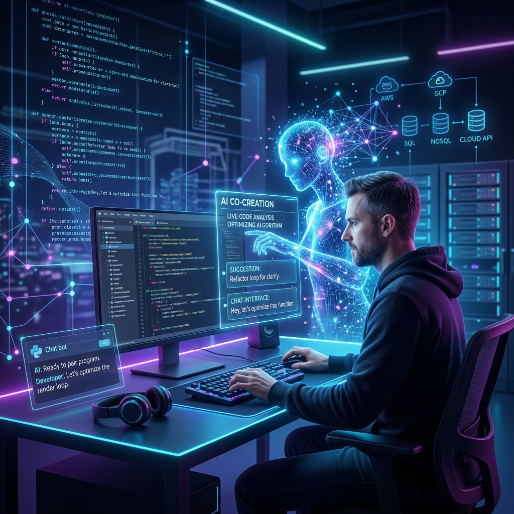

# 🤝 不懂程式也能看懂！我與 AI 助理攜手 20 分鐘無痛打造雲端 LINE 機器人實錄

想像一下，如果今天你想為自己的商家或社群打造一個自動回覆的 LINE 機器人，但想到要寫複雜的程式碼、租用雲端伺服器、還要設定安全的網址（HTTPS），是不是就讓你打退堂鼓了？

過去，這確實需要專業的工程團隊花費數天甚至數週的時間。但這一次，我做了一個有趣的實驗 —— **我與 AI 協同開發助理 Antigravity 攜手合作，在短短 20 分鐘內，完全透過「對話與協作」方式，把一個 LINE 機器人順利送到雲端運作，並做好了安全備份！**

這篇文章不談生硬的語法，而是用最白話的方式，帶你一窺現代「人機協同」的開發實況，看看非技術背景的人，未來如何也能輕鬆擁有自己的雲端服務。

---

## 📌 用生活例子看懂「機器人的幕後工作夥伴」

在動手之前，AI 助理先用非常生活化的比喻，跟我解釋了這次機器人上線需要哪些「隱形夥伴」：

1. **LINE 機器人（前台接待員）**：負責在第一線接收使用者的訊息。
2. **Node.js 程式（大腦）**：負責思考。當使用者說「你好」，大腦就決定回覆「你好」（這就是俗稱的 Echo Bot，打什麼就回什麼）。
3. **Docker（標準行李箱）**：把大腦程式、相關設定全部打包進一個規格統一的行李箱中，確保行李箱不論拿到哪台電腦，打開都能正常運作。
4. **GCP Cloud Run（雲端免租金店面）**：Google 提供的無伺服器託管空間。它就像一個**「有人來敲門才需要付電費」**的虛擬店面，沒人使用時完全不收費，而且還貼心地直接提供 LINE 官方規定的「安全防護加密網址（HTTPS）」，讓我們省下大筆網址設定費。
5. **GitHub（雲端保險箱）**：用來安全地儲存與備份我們的整套設計圖。

---

## 🤖 協同開發第一階段：AI 規劃，我給鑰匙

首先，我在 LINE 的官方開發者後台，申請了機器人的兩把「專屬密鑰」（就像是防偽印章與通行證）。

接著，我把通行證交給 AI 助理 Antigravity。它立刻在電腦中幫我建好專案空間，並自動寫出「大腦程式」與「打包行李箱（Dockerfile）」的設定。

過程中遇到了一個小插曲：電腦的套件安裝權限被鎖住了。過去這需要上網查一堆代碼去解除限制，但 AI 助理很聰明地說：*「沒關係，我們把套件安裝在專案目錄底下的專用快取區就好。」* 一句話，就幫我繞過了這個技術障礙。

---

## ☁️ 協同開發第二階段：把店面開張（部署到 GCP 雲端）

當我們要將行李箱（程式）送到 Google 雲端店面開張時，碰到了整趟旅程中最棘手的「技術阻礙」：

畫面彈出了紅色的錯誤訊息：
`ERROR: PERMISSION_DENIED: The caller does not have permission`

**白話翻譯**：*「Google 說我們沒有權限在它的地盤上蓋工廠！」*

### 💡 AI 助理的即時偵錯與自動修復
如果是一般人，看到這串英文通常就慌了。但這正是 AI 協同開發最迷人的地方 —— **它就像一個經驗豐富的資深工程顧問**。

Antigravity 主動去翻閱了 Google 的後台日誌，並用白話向我解釋：*「這是因為這個 Google 專案是全新的，我們的帳號和雲端工廠之間還沒有簽署『授權委託書』。」*

在得到我的確認後，AI 助理直接在背景幫我執行了授權指令，把以下兩份委託書簽好：
1. **服務帳戶使用者權限**：允許我們代表專案調度資源。
2. **Cloud Run 管理員權限**：允許我們在雲端正式開設店面。

授權完成後，我們再次執行上線。僅僅過了 60 秒，店面就成功開張，並給了我們一個專屬的安全加密網址：
`https://line-echo-bot-3sv3zqjszq-de.a.run.app`

我們把這個網址貼回 LINE 的官方後台——連線測試亮起綠燈，機器人正式上線！

---

## 🔒 協同開發第三階段：將設計圖鎖進 GitHub 雲端保險箱

最後一步是備份。既然要把設計圖放上公開的 GitHub 保險箱，防盜（資訊安全）就非常關鍵。

1. **裝上防窺保護貼（.gitignore）**：AI 助理貼心地幫我設定了防窺清單，確保我剛才給它的「LINE 通行證密鑰（.env 檔案）」會被留在本地，絕對不會被上傳到公開網路上。
2. **一鍵推送**：我在 GitHub 網站上建好一個空的保險箱，把網址提供給 AI 助理，它便在背景自動幫我完成了全部的上傳與備份。
3. **無痕清理**：為了防止剛才上傳時使用的臨時鑰匙殘留在電腦的設定中，上傳成功後，AI 助理**主動把本地的設定清理得一乾二淨**，讓資安防護做到滴水不漏。

---

## 💬 結語：人機協同 —— 讓創意不再被技術門檻卡住

這次體驗讓我最深切的感受是：**軟體開發的門檻正在被徹底打破**。

以前，要獨自完成這一整套流程，你需要學習命令列、伺服器配置、Docker 容器技術以及複雜的雲端 IAM 權限架構。但在 AI 助理 Antigravity 的協助下，開發過程變成了一場「有來有回的清晰對話」。

* **技術細節由 AI 精準執行**，包括處理權限報錯、設定安全防護與自動清理金鑰。
* **方向與決策由人類主導**，例如專案名稱、帳密提供與架構確認。

未來的程式開發，重點不再是記憶那些生硬的指令，而是**「如何清晰地表達你的創意與邏輯」**。20 分鐘，一個 24 小時在雲端運作的 LINE 機器人就此誕生。

不論你是不是工程師，我都非常鼓勵你試著與 AI 助手合作，把腦中的好點子動手實作出來。科技不該是高牆，而是一扇只要你願意對話，就會為你開啟的門。

---
*本專案的完整程式碼與安全設定已全數備份至 GitHub，如果您對建立自己的 LINE 機器人或與 AI 協同開發感興趣，歡迎隨時留言與我交流！*
